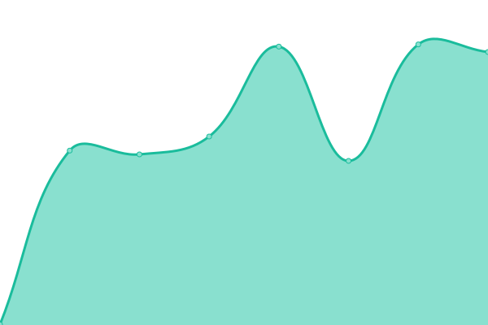
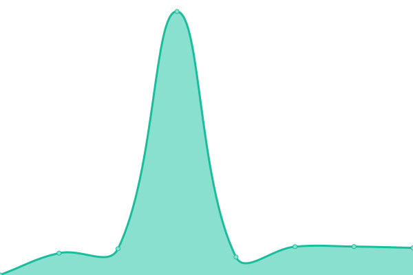
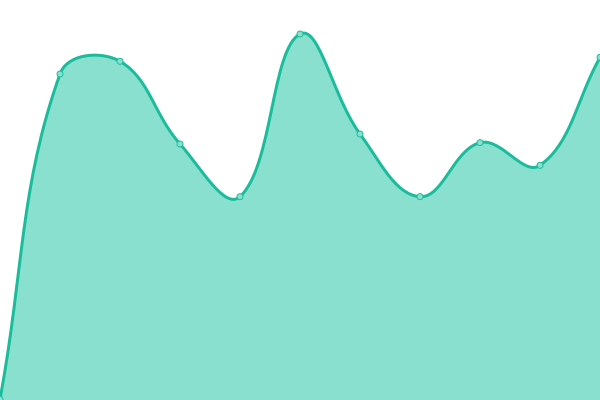

# [📈 Live Status](https://Tealk.github.io/upptime): <!--live status--> **🟩 All systems operational**

This repository contains the open-source uptime monitor and status page for [Tealk](https://Tealk.github.io/upptime), powered by [Upptime](https://github.com/upptime/upptime).

With [Upptime](https://upptime.js.org), you can get your own unlimited and free uptime monitor and status page, powered entirely by a GitHub repository. We use [Issues](https://github.com/Tealk/upptime/issues) as incident reports, [Actions](https://github.com/Tealk/upptime/actions) as uptime monitors, and [Pages](https://Tealk.github.io/upptime) for the status page.

<!--start: status pages-->
<!-- This summary is generated by Upptime (https://github.com/upptime/upptime) -->
<!-- Do not edit this manually, your changes will be overwritten -->
<!-- prettier-ignore -->
| URL | Status | History | Response Time | Uptime |
| --- | ------ | ------- | ------------- | ------ |
|  [Homepage](https://rollenspiel.monster) | 🟩 Up | [homepage.yml](https://github.com/Tealk/upptime/commits/HEAD/history/homepage.yml) | 

 1185ms
     
 | 

<a href="https://Tealk.github.io/upptime/history/homepage">97.86%</a>
    

|  [Mastodon-Web](https://rollenspiel.social/health) | 🟩 Up | [mastodon-web.yml](https://github.com/Tealk/upptime/commits/HEAD/history/mastodon-web.yml) | 

 500ms
     
 | 

<a href="https://Tealk.github.io/upptime/history/mastodon-web">100.00%</a>
    

|  [Mastodon-Streaming](https://rollenspiel.social/api/v1/streaming/health) | 🟩 Up | [mastodon-streaming.yml](https://github.com/Tealk/upptime/commits/HEAD/history/mastodon-streaming.yml) | 

 113ms
     
 | 

<a href="https://Tealk.github.io/upptime/history/mastodon-streaming">100.00%</a>
    

|  [Mobilizon](https://rollenspiel.events) | 🟩 Up | [mobilizon.yml](https://github.com/Tealk/upptime/commits/HEAD/history/mobilizon.yml) | 

 562ms
     
 | 

<a href="https://Tealk.github.io/upptime/history/mobilizon">100.00%</a>
    

|  [Writefreely](https://blog.rollenspiel.monster) | 🟩 Up | [writefreely.yml](https://github.com/Tealk/upptime/commits/HEAD/history/writefreely.yml) | 

 572ms
     
 | 

<a href="https://Tealk.github.io/upptime/history/writefreely">100.00%</a>
    

|  [Lemmy-UI](https://rollenspiel.forum) | 🟩 Up | [lemmy-ui.yml](https://github.com/Tealk/upptime/commits/HEAD/history/lemmy-ui.yml) | 

 962ms
     
 | 

<a href="https://Tealk.github.io/upptime/history/lemmy-ui">100.00%</a>
    

|  [Lemmy-Backend](https://rollenspiel.forum/api/v3/post/list) | 🟩 Up | [lemmy-backend.yml](https://github.com/Tealk/upptime/commits/HEAD/history/lemmy-backend.yml) | 

 147ms
     
 | 

<a href="https://Tealk.github.io/upptime/history/lemmy-backend">100.00%</a>
    

|  [Flohmarkt](https://rollenspiel.trade) | 🟩 Up | [flohmarkt.yml](https://github.com/Tealk/upptime/commits/HEAD/history/flohmarkt.yml) | 

 610ms
     
 | 

<a href="https://Tealk.github.io/upptime/history/flohmarkt">100.00%</a>
    

|  [Element](https://rollenspiel.chat) | 🟩 Up | [element.yml](https://github.com/Tealk/upptime/commits/HEAD/history/element.yml) | 

 403ms
     
 | 

<a href="https://Tealk.github.io/upptime/history/element">100.00%</a>
    

|  [Cinny](https://cinny.rollenspiel.chat) | 🟩 Up | [cinny.yml](https://github.com/Tealk/upptime/commits/HEAD/history/cinny.yml) | 

 488ms
     
 | 

<a href="https://Tealk.github.io/upptime/history/cinny">100.00%</a>
    

|  [Phanpy](https://phanpy.rollenspiel.social) | 🟩 Up | [phanpy.yml](https://github.com/Tealk/upptime/commits/HEAD/history/phanpy.yml) | 

 564ms
     
 | 

<a href="https://Tealk.github.io/upptime/history/phanpy">100.00%</a>
    

|  [Photon](https://photon.rollenspiel.forum) | 🟩 Up | [photon.yml](https://github.com/Tealk/upptime/commits/HEAD/history/photon.yml) | 

 420ms
     
 | 

<a href="https://Tealk.github.io/upptime/history/photon">100.00%</a>
    

|  [Authentik](https://auth.rollenspiel.monster) | 🟩 Up | [authentik.yml](https://github.com/Tealk/upptime/commits/HEAD/history/authentik.yml) | 

 744ms
     
 | 

<a href="https://Tealk.github.io/upptime/history/authentik">100.00%</a>
    

|  [Teamspeak](162.55.131.56) | 🟩 Up | [teamspeak.yml](https://github.com/Tealk/upptime/commits/HEAD/history/teamspeak.yml) | 

 112ms
     
 | 

<a href="https://Tealk.github.io/upptime/history/teamspeak">100.00%</a>
    

|  [Mumble](mumble.rollenspiel.monster) | 🟩 Up | [mumble.yml](https://github.com/Tealk/upptime/commits/HEAD/history/mumble.yml) | 

 112ms
     
 | 

<a href="https://Tealk.github.io/upptime/history/mumble">100.00%</a>
    

|  [Synapse](https://rollenspiel.chat/health) | 🟩 Up | [synapse.yml](https://github.com/Tealk/upptime/commits/HEAD/history/synapse.yml) | 

 361ms
     
 | 

<a href="https://Tealk.github.io/upptime/history/synapse">100.00%</a>
    

|  [Nextcloud](https://rollenspiel.cloud) | 🟩 Up | [nextcloud.yml](https://github.com/Tealk/upptime/commits/HEAD/history/nextcloud.yml) | 

 747ms
     
 | 

<a href="https://Tealk.github.io/upptime/history/nextcloud">100.00%</a>
    

|  [Framadate](https://poll.rollenspiel.monster) | 🟩 Up | [framadate.yml](https://github.com/Tealk/upptime/commits/HEAD/history/framadate.yml) | 

 438ms
     
 | 

<a href="https://Tealk.github.io/upptime/history/framadate">100.00%</a>
    

|  [Bookstack](https://rollenspiel.wiki) | 🟩 Up | [bookstack.yml](https://github.com/Tealk/upptime/commits/HEAD/history/bookstack.yml) | 

 788ms
     
 | 

<a href="https://Tealk.github.io/upptime/history/bookstack">100.00%</a>
    

|  [FreshRSS](https://rss.rollenspiel.monster) | 🟩 Up | [fresh-rss.yml](https://github.com/Tealk/upptime/commits/HEAD/history/fresh-rss.yml) | 

 941ms
     
 | 

<a href="https://Tealk.github.io/upptime/history/fresh-rss">100.00%</a>
    

|  [Wallabag](https://wallabag.rollenspiel.monster) | 🟩 Up | [wallabag.yml](https://github.com/Tealk/upptime/commits/HEAD/history/wallabag.yml) | 

 896ms
     
 | 

<a href="https://Tealk.github.io/upptime/history/wallabag">100.00%</a>
    

|  [Linkwarden](https://linkwarden.rollenspiel.monster) | 🟩 Up | [linkwarden.yml](https://github.com/Tealk/upptime/commits/HEAD/history/linkwarden.yml) | 

 442ms
     
 | 

<a href="https://Tealk.github.io/upptime/history/linkwarden">100.00%</a>
    

|  [PrivateBin](https://paste.rollenspiel.monster) | 🟩 Up | [private-bin.yml](https://github.com/Tealk/upptime/commits/HEAD/history/private-bin.yml) | 

 612ms
     
 | 

<a href="https://Tealk.github.io/upptime/history/private-bin">100.00%</a>
    

|  [Vaultwarden](https://safe.rollenspiel.monster) | 🟩 Up | [vaultwarden.yml](https://github.com/Tealk/upptime/commits/HEAD/history/vaultwarden.yml) | 

 400ms
     
 | 

<a href="https://Tealk.github.io/upptime/history/vaultwarden">100.00%</a>
    

|  [ntfy](https://ntfy.rollenspiel.monster/v1/health) | 🟩 Up | [ntfy.yml](https://github.com/Tealk/upptime/commits/HEAD/history/ntfy.yml) | 

 381ms
     
 | 

<a href="https://Tealk.github.io/upptime/history/ntfy">100.00%</a>
    

|  [Firefly III](https://firefly.rollenspiel.monster) | 🟩 Up | [firefly-iii.yml](https://github.com/Tealk/upptime/commits/HEAD/history/firefly-iii.yml) | 

 558ms
     
 | 

<a href="https://Tealk.github.io/upptime/history/firefly-iii">100.00%</a>
    

|  [Vikunja](https://tasks.rollenspiel.monster) | 🟩 Up | [vikunja.yml](https://github.com/Tealk/upptime/commits/HEAD/history/vikunja.yml) | 

 422ms
     
 | 

<a href="https://Tealk.github.io/upptime/history/vikunja">100.00%</a>
    

|  [Grafana](https://monitor.rollenspiel.monster) | 🟩 Up | [grafana.yml](https://github.com/Tealk/upptime/commits/HEAD/history/grafana.yml) | 

 651ms
     
 | 

<a href="https://Tealk.github.io/upptime/history/grafana">100.00%</a>
    

|  [MollySocket](https://mollysocket.rollenspiel.monster) | 🟩 Up | [molly-socket.yml](https://github.com/Tealk/upptime/commits/HEAD/history/molly-socket.yml) | 

 471ms
     
 | 

<a href="https://Tealk.github.io/upptime/history/molly-socket">100.00%</a>
    

|  [osTicket](https://ticket.rollenspiel.monster) | 🟩 Up | [os-ticket.yml](https://github.com/Tealk/upptime/commits/HEAD/history/os-ticket.yml) | 

 410ms
     
 | 

<a href="https://Tealk.github.io/upptime/history/os-ticket">100.00%</a>
    

|  [LibreTranslate](https://translate.rollenspiel.monster) | 🟩 Up | [libre-translate.yml](https://github.com/Tealk/upptime/commits/HEAD/history/libre-translate.yml) | 

 552ms
     
 | 

<a href="https://Tealk.github.io/upptime/history/libre-translate">100.00%</a>
    

|  [Mailcow](https://mail.rollenspiel.network) | 🟩 Up | [mailcow.yml](https://github.com/Tealk/upptime/commits/HEAD/history/mailcow.yml) | 

 943ms
     
 | 

<a href="https://Tealk.github.io/upptime/history/mailcow">100.00%</a>
    

|  [relay](https://relay.rollenspiel.monster) | 🟩 Up | [relay.yml](https://github.com/Tealk/upptime/commits/HEAD/history/relay.yml) | 

 416ms
     
 | 

<a href="https://Tealk.github.io/upptime/history/relay">100.00%</a>
    

<!--end: status pages-->

[**Visit our status website →**](https://Tealk.github.io/upptime)

## 📄 License

- Powered by: [Upptime](https://github.com/upptime/upptime)
- Code: [MIT](./LICENSE) © [Anand Chowdhary](https://anandchowdhary.com), supported by [Pabio](https://pabio.com)
- Data in the `./history` directory: [Open Database License](https://opendatacommons.org/licenses/odbl/1-0/)
